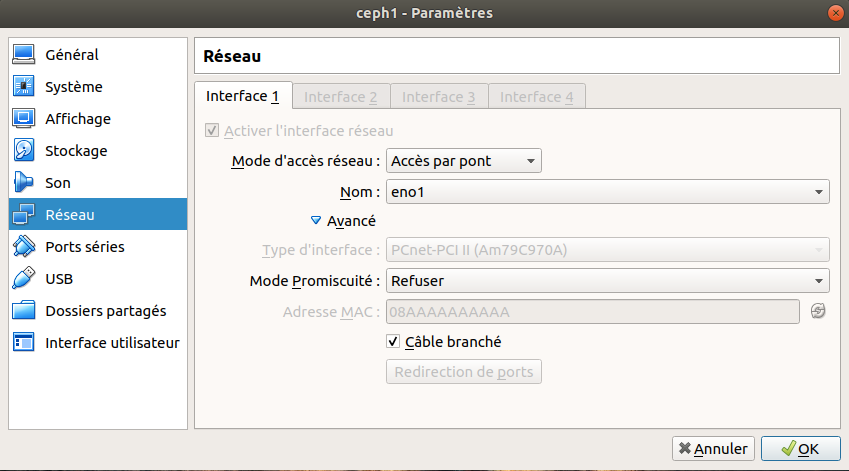
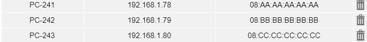
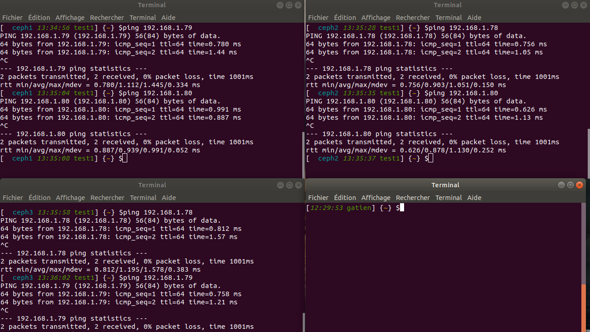

Gatien Ryckebusch 2019-2020 étudiant université de lille

# PFE - Mise en oeuvre d'un système de fichier pair-à-pair sur raspberry pi4

Dans cette parti nous allons suivre l'installation d'un système de fichier cepth sur des machines virtuelle.  

##quelques informations

		iso de la machine hote           : ubuntu-18.04-minial
		logiciel de virtualisation       : virtualBox
		image des machines virtuels (MV) : debian-8.11.1-i386-netinst.iso  (32bits)
  
Machine Virtuelle:  

		Nom   |    Adress MAC     | adresse IP (fixée avec dhcp) 
		ceph1 | 08:AA:AA:AA:AA:AA | 192.168.1.78
		ceph2 | 08:BB:BB:BB:BB:BB | 192.168.1.79
		ceph3 | 08:CC:CC:CC:CC:CC | 192.168.1.80

## 1 ére étape : installation minimal de la machine hôte. 

une fois installation minimal d'ubuntu 18.04 fais suivez le sript ubuntu 18.0.4_minimal.sh ou lancer-le.  
lien : https://github.com/rycktien/pfe_TIIR_gatien.ryckebusch_2019/tree/master/ceph_Debian/ubuntu18.04_minimal.sh
 

## 2 ème étape : virtualBox et config des MVs

lancer virtualBox sur la machine Hôte

> virutalBox

puis en haut à gauche cliquer sur nouveaux  
Nous allons appeler notre première MV "Debian_minima"  

une fois la MV créer il faut configurer le réseaux ici on relie
notre MV et notre hôte par un pont ici on fixe juste l'adresse MAC de la MV pour que notre serveur DHCP fixe l'adresse IP en fonction de cette dernière.

voici ma configuration de ma MV par virtualbox

  

Pour la configuration du réseau j'ai choisi de passer par ma  
carte Réseau ethernet puis de fixer l'adresse MACs de la MV Pour  
pouvoir rajouter une régle dhcp et donc fixer l'adresse IP  
en fonction des adress MAC ici j'ai fixé :  

		ceph1 -> 08:AA:AA:AA:AA:AA
		ceph2 -> 08:BB:BB:BB:BB:BB
		ceph3 -> 08:CC:CC:CC:CC:CC

et donc voici la configuration du *DHCP*  

		ceph1 -> PC-241 -> 192.168.1.78
		ceph1 -> PC-242 -> 192.168.1.79
		ceph1 -> PC-243 -> 192.168.1.80

  

une fois les machines configurées démarrer la MV puis selectioner l'iso télécharger précèdement.  

  

maintemant installer votre debian.  
une fois le debian installer connecté vous et installons quelques paquets pour cela suivez le scipt 
"**VirtualBox/startDebian.sh**"  
   
**lien** : https://github.com/rycktien/pfe_TIIR_gatien.ryckebusch_2019/tree/master/ceph_Debian/VirtualBox/startDebian.sh  

ou rajouter le dans votre MV et executer le.  

le fichier *met à jour le système* et *install openssh* pour pouvoir se connecter depuis l'hôte à la MV.  

Maintemant que les paquets sont à jour et que ssh est installé.  
nous allons utiliser cette **MV comme backup** est donc clôner cette dernière pour créer nos MVs qui servirons à l'installation
d'un systeme de fichier ceph.   

éteignez votre MV "**debian_minima**"  

Puis créeons une deuxième MV que nous appellerons "**Ceph1**".  
Pour cela clique droit sur notre MV "**debian_minima**" puis clic sur cloner.  

  

puis cloné 2 autres machine **ceph2** et **ceph3** à partir de "**Debian_minima**" et changer leur **adresses MAC**.

  

Avant de lancer les MVs **n'oublié pas de changer les adresses MAC**  
de ces dernières pour pouvoir récuperer *une adresse IP via le dhcp*.  

puis lancer les :  

  

ici je l'ai lance *sans interface graphique* car je compte juste me  
connecter en SSH dessus grâce au IP qui leur sont donner par  
mon server DHCP et donc je connais leur IPs.

enfin je me connecte vous sur mes MVs en ssh :  

		ceph1 : ssh <user>@192.168.1.78
		ceph1 : ssh <user>@192.168.1.79
		ceph1 : ssh <user>@192.168.1.80
		car nous avons fixer l adress ip de ceph1,ceph2,ceph3

  
*ici j'ai changer le bashrc, la variable environnement PS1 pour afficher dans quel MV je me trouve *  

puis j'ai fais un test de ping.  

## 3 éme étape : installation du system de fichier ceph dans les MVs

