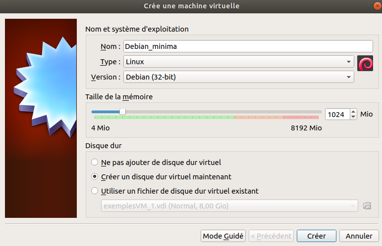
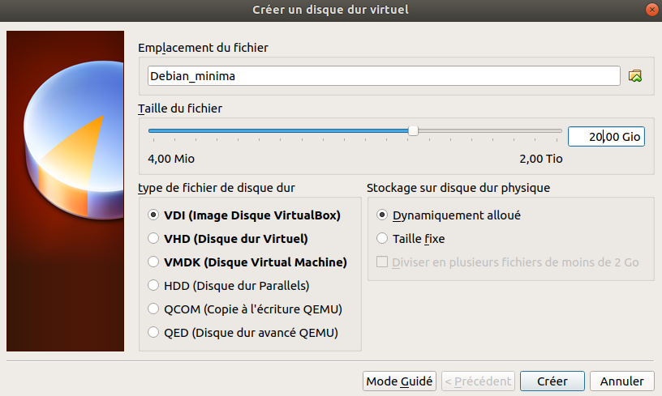
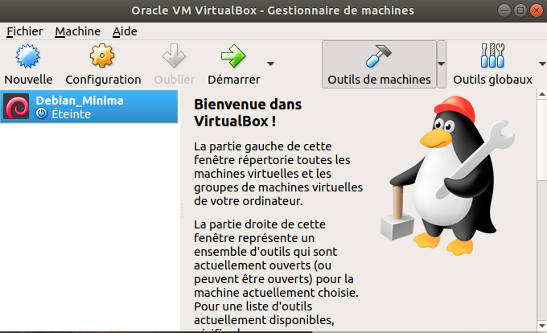
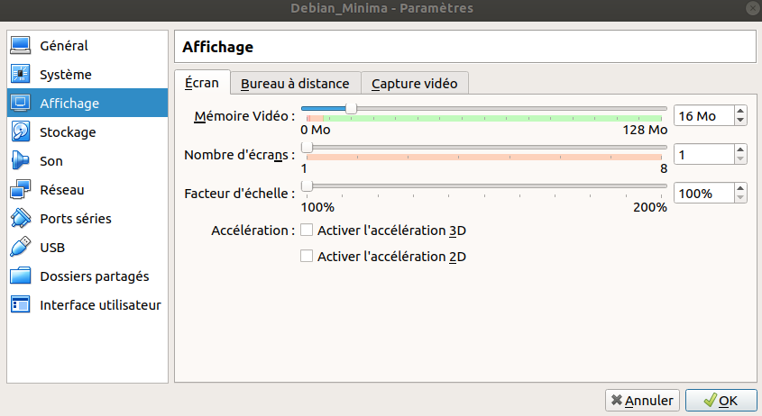
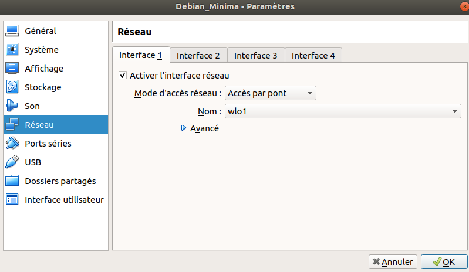
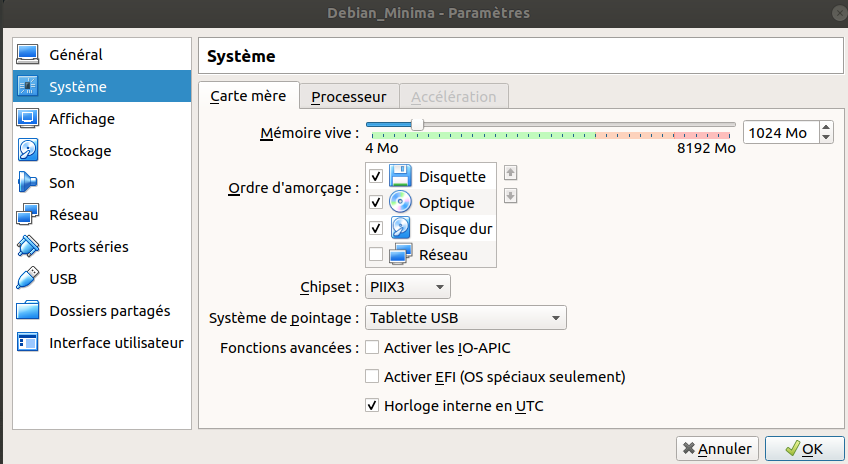
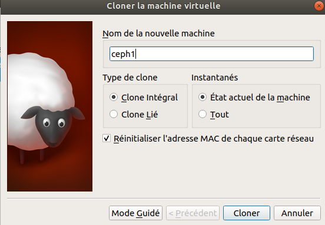
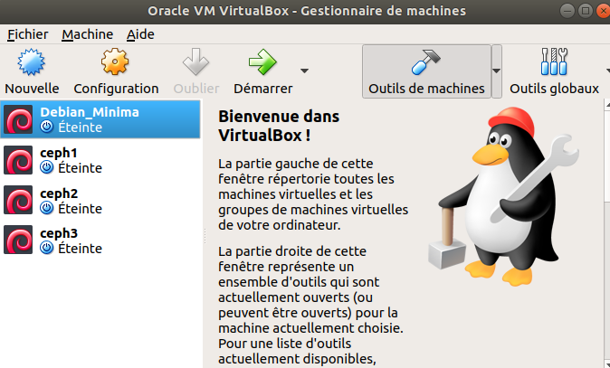
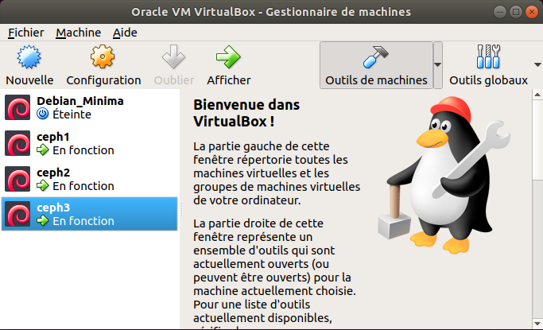
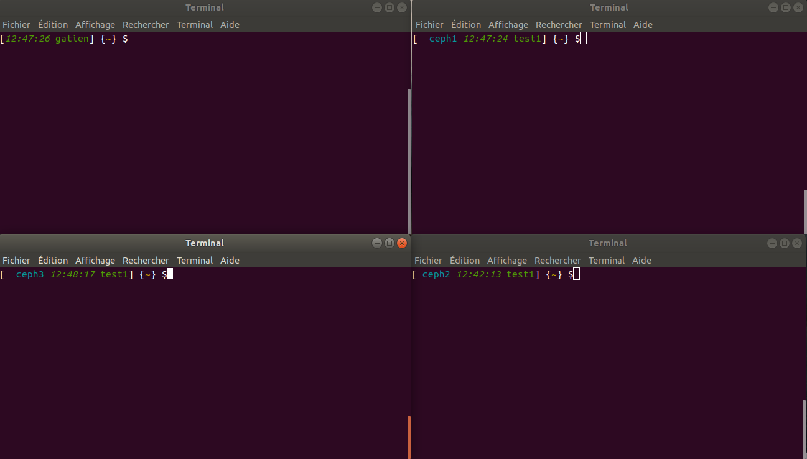

Gatien Ryckebusch 2019-2020 étudiant université de lille

# PFE - Mise en oeuvre d'un système de fichier pair-à-pair sur raspberry pi4

Dans cette parti nous allons suivre l'installation d'un système de fichier cepth sur des machines virtuelle.  

quelques informations :  

		iso de la machine hote           : ubuntu-18.04-minial
		logiciel de virtualisation       : virtualBox
		image des machines virtuels (MV) : debian-8.11.1-i386-netinst.iso  (32bits)

## 1 ére étape : installation minimal de la machine hôte. 

une fois installation minimal d'ubuntu 18.04 fais suivez le sript ubuntu 18.0.4_minimal.sh ou lancer-le.  
lien : https://github.com/rycktien/pfe_TIIR_gatien.ryckebusch_2019/tree/master/ceph_Debian/ubuntu18.04_minimal.sh
 

## 2 ème étape : virtualBox et config des MVs

lancer virtualBox sur la machine Hôte

> virutalBox

puis en haut à gauche cliquer sur nouveaux  
Nous allons appeler notre première MV "Debian_minima"  

une fois la MV créer il faut configurer le réseaux ici on relie
nos MVs et notre hôte par un pont ici on supposera que nos machine on une ip static et qu'il reseteront brancher en permamance.  

voici ma configuration de ma MV par virtualbox

  
  
  
	
une fois les machines configurées démarrer la MV puis selectioner l'iso télécharger précèdement.

  

maintemant installer votre debian.  
une fois le debian installer connecté vous et installons quelques paquets pour cela suivez le scipt 
"VirtualBox/startDebian.sh"  
   
lien : https://github.com/rycktien/pfe_TIIR_gatien.ryckebusch_2019/tree/master/ceph_Debian/VirtualBox/startDebian.sh  

ou rajouter le dans votre MV et executer le   

le fichier met à jour le système et install openssh pour pouvoir se connecter depuis l'hôte à la MV.  

Maintemant que les paquets sont à jour et que ssh est installé.  
nous allons utiliser cette MV comme backup est donc clôner cette dernière pour créer nos MVs qui servirons à l'installation
d'un systeme de fichier ceph.   

éteignez votre MV "debian_minima"  

Puis créeons une deuxième MV que nous appellerons "Ceph1".  
Pour cela clique droit sur notre MV "debian_minima" puis clic sur cloner.  

  

Puis lancer cette VM, récuperée sont address ip.  
> ip a  
Sur l'hote lancer la commande ssh  

> ssh "utilisateur"@"ip":"port ssh"  

puis cloné 2 autres machine ceph2 et ceph3 à partir de "Debian_minima"

  
  

enfin connecté vous sur les deux autres machine en ssh

  
*ici j'ai changer le bashrc la variable environnement PS1 pour afficher dans quel MV je me trouve *

3) installation du system de fichier ceph

