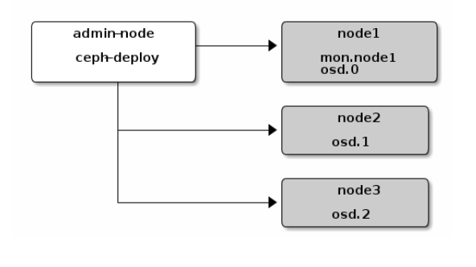
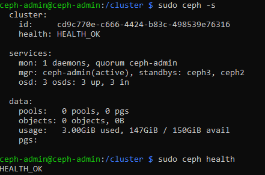
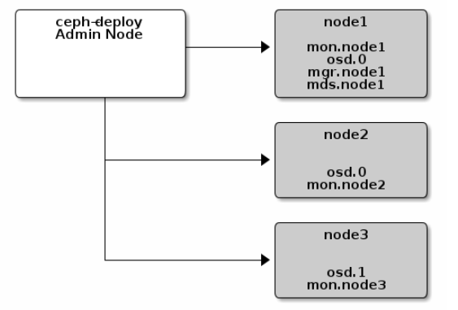
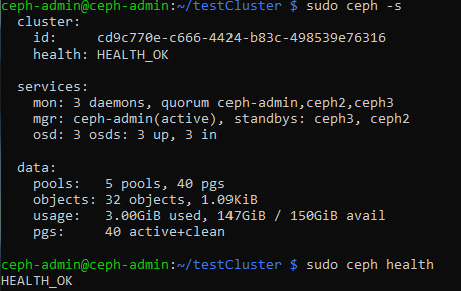

Gatien Ryckebusch 2019-2020 étudiant université de lille

# PFE - Mise en oeuvre d'un système de fichier pair-à-pair sur raspberry pi4

Dans cette parti nous allons nous voir l'installation du systéme de fichier ceph sur des raspberry pi 4.

## Quelques informations

ip du réseau : 192.168.1.0/24  
iso de la machine hote : 2019-09-26-raspbian-buster-lite.img  
login : pi  
password : raspberry  
IP :
		
		Nom         |  adresse IP
		ceph-admin  | 192.168.1.63
		ceph2       | 192.168.1.71
		ceph3       | 192.168.1.84
stockage :

    Une carte SD de 512Go partitionnée de cette manière pour les 3 raspberry.
    Disk /dev/mmcblk0: 476.9 GiB :
        /dev/mmcblk0p1           8192    532479    524288  256M  c W95 FAT32 (LBA)  # BOOT
        /dev/mmcblk0p2         532480 210247679 209715200  100G 83 Linux            # / 
        /dev/mmcblk0p3      210247680 315105279 104857600   50G 83 Linux            # partition de stockage utilisée par ceph
    la place non utilisée est gardée pour le futur.

## 1 ère étape : Installation commune.

mise à jour du système

> sudo apt-get update -y

> sudo apt-get upgrade -y

installation de lvm

> sudo apt-get install lvm2

modification du fichier /etc/hosts 

> sudo echo -e "192.168.1.63  ceph-admin\n192.168.1.71 ceph2\n192.168.1.84 ceph3" | sudo tee -a /etc/hosts

ntp

> sudo apt install ntpdate -y

> sudo apt install ntp -y

> sudo service ntp stop

> sudo timedatectl  set-timezone Europe/Paris

> sudo timedatactl set-ntp on

> sudo ntpdate 0.fr.pool.ntp.org

ssh

> sudo sudo apt-get install openssh-server -y

> sudo systemctl enable ssh

> sudo systemctl start ssh

> echo -e "Host ceph-admin\n\tHostname ceph-admin\n\tUser ceph-admin\nHost ceph2\n\tHostname ceph2\n\tUser ceph2\nHost ceph3\n\tHostname ceph3\n\tUser ceph3\n" | sudo tee -a ~/.ssh/config

## 2 ème étape : configuration de l'utilisateur et des noms de machines

sur ceph-amdmin  
user : ceph-admin  
password : ceph  
  
    
utilisateur

> sudo useradd ceph-admin --shell /bin/bash --create-home

> sudo passwd ceph-admin

> sudo addgroup ceph-admin sudo

> echo "ceph-admin" ALL = (root) NOPASSWD:ALL" | sudo tee /etc/sudoers.d/ceph-admin

nom de la machine

> echo "ceph-admin" | sudo tee /etc/hostname

sur ceph2 :
user : ceph2  
password : ceph  

> sudo useradd ceph2 --shell /bin/bash --create-home

> sudo passwd ceph2

> sudo addgroup ceph2 sudo

> echo "ceph2" ALL = (root) NOPASSWD:ALL" | sudo tee /etc/sudoers.d/ceph2

nom de la machine

> echo "ceph2" | sudo tee /etc/hostname

sur ceph3 :
user : ceph3  
password : ceph  

> sudo useradd ceph3 --shell /bin/bash --create-home

> sudo passwd ceph3

> sudo addgroup ceph3 sudo

> echo "ceph3" ALL = (root) NOPASSWD:ALL" | sudo tee /etc/sudoers.d/ceph3

nom de la machine

> echo "ceph3" | sudo tee /etc/hostname

## 3 ème étape : Génération des clés ssh et configuration

sur ceph-admin  
il faut laisser la phrase secrète vide.

> ssh-keygen

> ssh-copy-id ceph-admin@ceph-admin

> ssh-copy-id ceph2@ceph2

> ssh-copy-id ceph3@ceph3

## 4 ème étape : Mise en place d'un système de fichiers basiques avec ceph.

objectif :

sur ceph-admin 

> sudo apt-get install ceph-deploy -y

création du dossier pour la création des clés et des fichiers de configuration

> mkdir /cluster

> cd /cluster

ceph-deploy ne dois pas être lancer en sudo si  
la commande échoue vérifier alors votre configuration  
ssh et votre fichier /etc/hosts.
Créaction du cluster avec comme premier moniteur ceph-admin.

> ceph-deploy new ceph-admin

ajouter public_network dans le fichier cepf.conf

> echo "public_network = 192.168.1.0/24" | sudo tee -a /cluster/ceph.conf

installation de ceph et copie des fichiers de configuration dans les différentes machines.

> ceph-deploy install ceph-admin ceph2 ceph3

Déployement du premier moniteur sur la machine ceph-admin.

> ceph-deploy mon create-initial

Une fois fais plusieurs clés apparaîtront dans le dossier.
Il nous reste à copier les clés administration dans les autres machines.

> ceph-deploy admin ceph-admin ceph2 ceph3

Une fois la copie des clefs effectuée, nous allons créer 3 gestionnaires (ceph-mgr).

> ceph-deploy mgr create ceph-admin ceph2 ceph3 

Maintemant nous allons créer 3 osd qui nous servirons de stockage physique à notre cluster.
Pour ce faire nous avons une partition de 50go dans /dev/mmcblk0p3 dans chacune de nos machines.

> ceph-deploy osd create --data /dev/mmcblk0p3 ceph2

> ceph-deploy osd create --data /dev/mmcblk0p3 ceph3

> ceph-deploy osd create --data /dev/mmcblk0p3 ceph-admin

Maintenant nous avons la base de notre système de fichiers.  
vérifions avec la commande "sudo ceph -s" et "sudo ceph health".

## 4 éme étape : Amélioration du système de fichiers ceph.

objectif :  

il nous faut un serveur de métadonnées (ceph-mds).

> ceph-deploy mds create ceph-admin

Rajoutons maintenant d'autres moniteurs "ceph2" et "ceph3" à notre cluster.

> ceph-deploy mon add ceph2

> ceph-deploy mon add ceph3

Nous pouvons rajouter la passerelle rado pour interagir avec notre cluster.

> ceph-deploy rgw create ceph-admin

Allons vérifier l'état de notre cluster.

