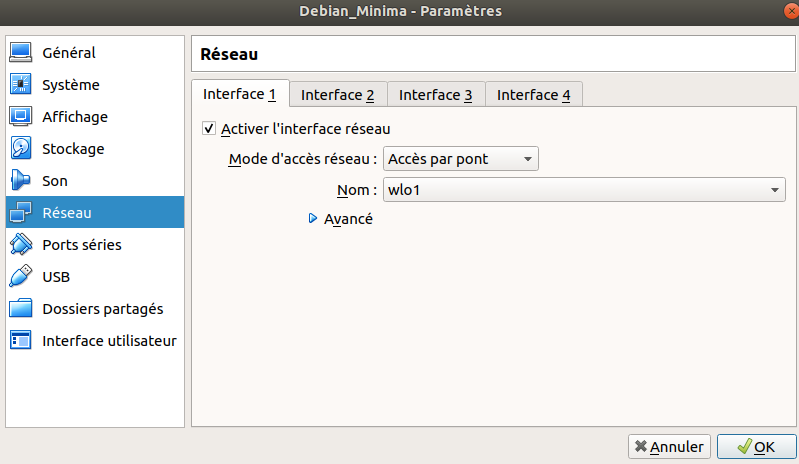
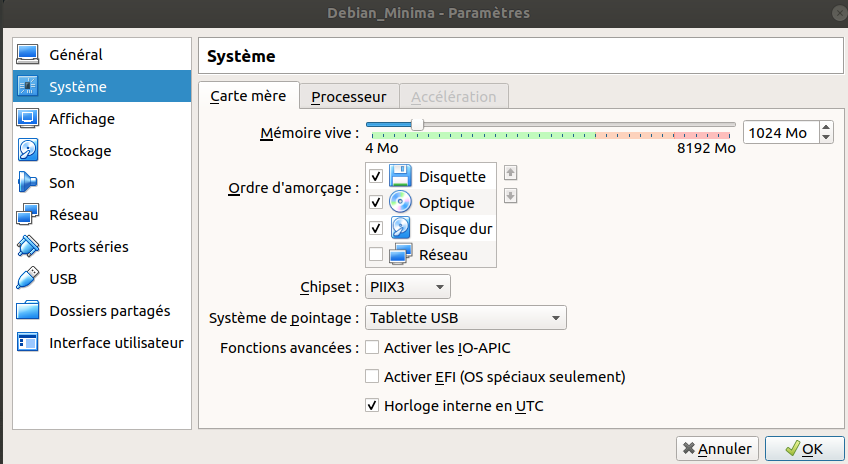
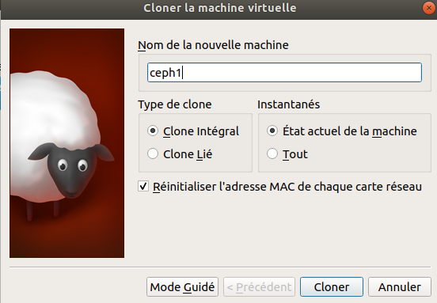
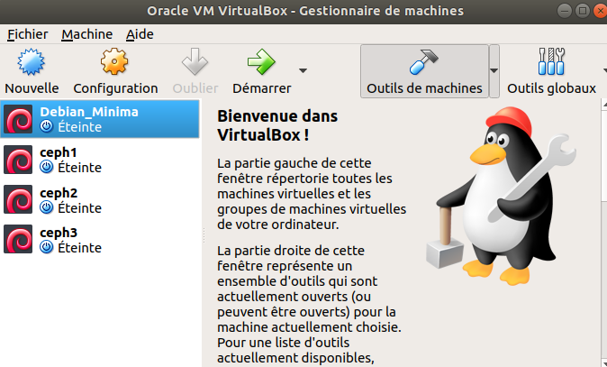
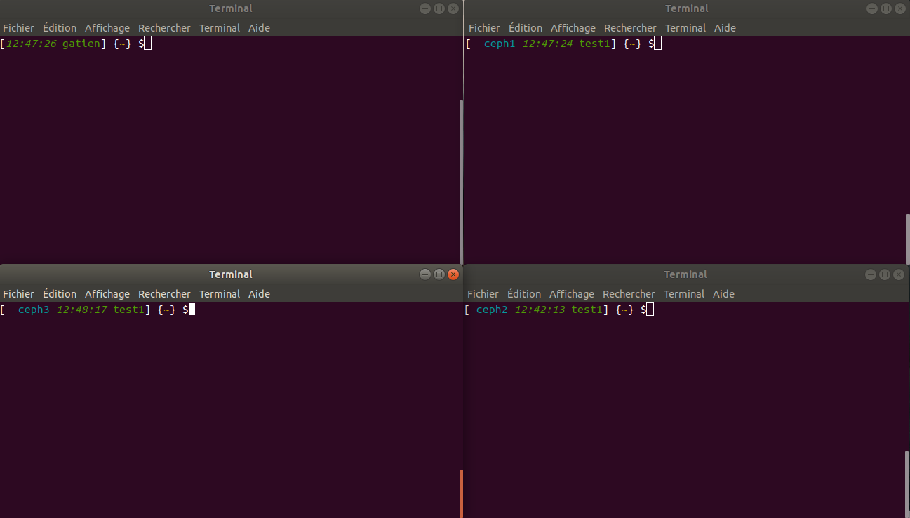

##Gatien ryckebusch
# PFE - Mise en oeuvre d'un système de fichier pair-à-pair sur raspberry pi4

I) mise en place d'un systeme de fichier ceph sur des machine virtuelle

		iso de la machine hote     : ubuntu-18.04-minial
		logiciel de virtualisation : virtualBox
		image des vm               : iso/debian-8.11.1-i386-netinst.iso (32bits)

1 ére étape : installation minimal de la machine hôte : 

		une fois installation minimal d'ubuntu 18.04 fais 
		suivez le sript ubuntu 18.0.4_minimal.sh ou lancer-le.
 

2 ème étape : virtualBox et config des VMs

lancer virtualBox sur la machine Hôte

		virutalBox

puis en haut à gauche cliquer sur nouveaux
puis suivez les images

une fois la vm créer if faut configurer le réseaux ici on relie
nos VMs et notre hôte par un pont ici on supposera que nos machine on
une ip static et qu'il reseteront brancher en permamance.

voici ma configuration de ma VM par virtualbox

	
une fois les machines configurées démarrer la vm puis selectioner l'iso télécharger précèdement.

maintemant installer votre debian.
une fois le debian installer connecté vous

et installons quelques paquets pour sela lancer le fichier dans "VirtualBox/startDebian.sh"
ou suiver les commande une à une.

le fichier met à jour le système et install openssh pour pouvoir se connecter depuis l'hôte
à la vm.

Maintemant que les paquets sont à jour et que ssh est installé. nous allons utiliser cette vm 
comme backup est donc clôner cette dernière pour créer nos VMs qui servirons à l'installation
d'un systeme de fichier ceph. 

le but est de clôner cette VM afin d'avoir une nouvelle machine avec que le ssh actif puis
de se connecter via la commande ssh puis se sois suivre un script qui installera le systeme de fichier.

éteignez votre vm "debian_minima" puis créeons une deuxième VM que nous appellerons "Ceph1"
pour cela clique droit sur notre VM "debian_minima" puis clic sur cloner

puis lancer cette VM recuperer sont address ip
pour sur l'hote lancer la commande ssh

		> ssh "utilisateur"@"ip":"port ssh"

puis cloné 2 autres machine ceph2 et ceph3 

enfin connecté vous sur les deux autres machine en ssh

3) installation du system de fichier ceph

