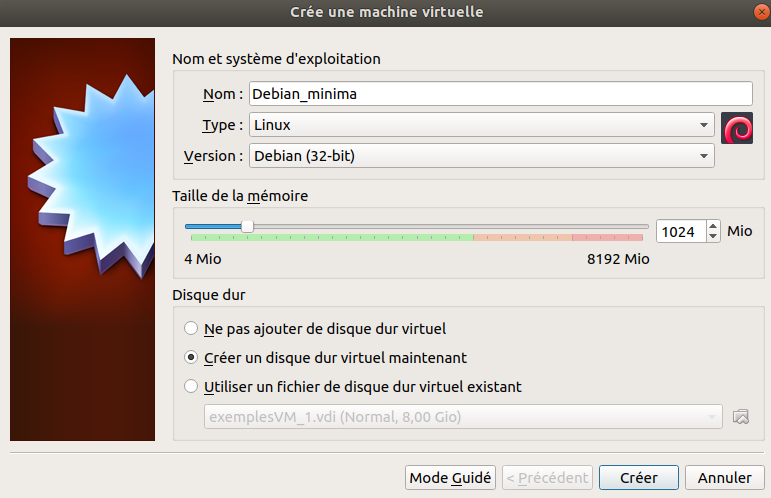
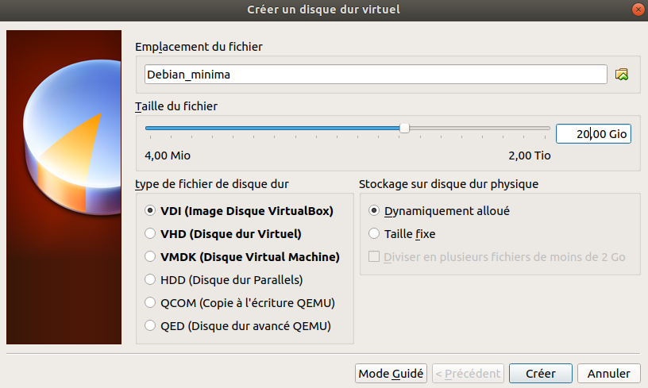
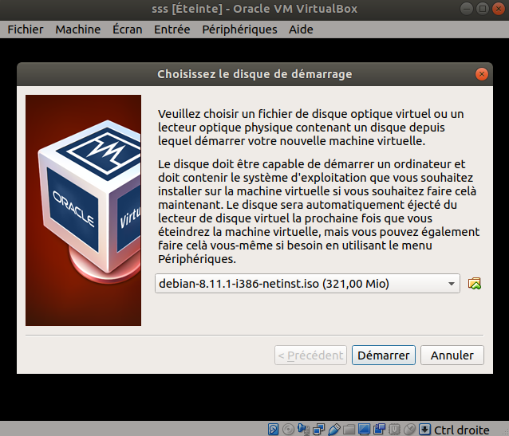

##Gatien ryckebusch
# PFE - Mise en oeuvre d'un système de fichier pair-à-pair sur raspberry pi4

I) mise en place d'un systeme de fichier ceph sur des machine virtuelle

iso de la machine hote     : ubuntu-18.04-minial
logiciel de virtualisation : virtualBox
image des vm               : iso/debian-8.11.1-i386-netinst.iso (32bits)

1 ére étape : installation minimal de la machine hôte : 

une fois installation minimal d'ubuntu 18.04 fais 
suivez le sript ubuntu 18.0.4_minimal.sh ou lancer-le.
 
2 ème étape : virtualBox et config des VMs

lancer virtualBox sur la machine Hôte

> virutalBox

puis en haut à gauche cliquer sur nouveaux
puis suivez les images

